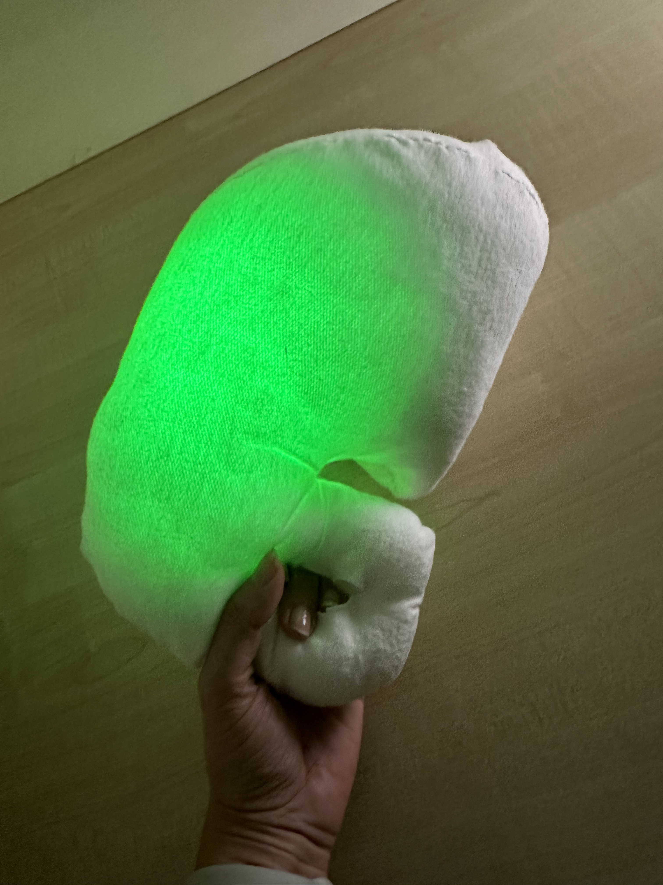

# Echo – An AI‑based Toy for Symbolic Play Recognition and Data Collection 

---

## Overview
**Echo** is an intelligent toy designed to recognize and log **symbolic play activities** in children with Autism Spectrum Conditions.  
It combines onboard sensors, real‑time classification, and a custom Android application to support both **therapy** and **data collection** within the IM‑TWIN research framework.

Echo detects and classifies manipulative play gestures using embedded machine‑learning models trained on inertial data. The system provides **sound and light feedback**, while also logging structured data for offline analysis.

---

## Hardware Setup
- **Microcontroller:** ESP32 (with integrated MPU6050 IMU)  
- **Sensors:** MPU9265 sensor: 3‑axis accelerometer (±2 g) and gyroscope (±500 °/s), tilt angles 0–360°  
- **Outputs:** LEDs and speaker for multimodal feedback  
- **Prototype files:** `.fzz` breadboard, schematic, and PCB layouts are included in the electronics/ folder.  
- **Audio:** `mp3/` folder includes `.mp3` files for feedback behavior, please copy this folder in a microSD and put into the DFplayermini module.

---

## Firmware and Algorithms

### Folders and Functions
The firmware/ directory contains the Arduino sketch for Echo. This sketch integrates the motion‑classification model (already compiled into model.h) and controls the LEDs and DFPlayerMini. Simply open the .ino file in the Arduino IDE, install the required libraries, and upload it to your ESP32. No additional training is needed – the decision‑tree model is embedded and ready to run.

### Signal and Range
- Accelerometer: ±2 g (gravity compensation active)  
- Gyroscope: ±500 °/s  
- Tilt angles: 0–360°

## Android App (APK)

The app/ folder includes a prebuilt Android application (EchoApp.apk). Install this APK directly on an Android device (Android 8+ recommended). 

### Features
- Real‑time plotting of **tilt** and **accelerometer** data.  
- **Label selection buttons** for organizing recorded gestures.  
- Automatic creation of labeled log files.  
- Volume and LED sliders: LEDs turn on at startup, and users can control brightness and sound volume.  
- Bluetooth connection with Echo for real‑time classification feedback.

## 3D‑Printable Cover

The cover_3d/ directory provides STL files for a 3D‑printable cover/enclosure. Print the parts at 100 % scale using PLA or PETG, then assemble them around the ESP32 and DFPlayerMini according to the photographs in the folder. The cover is designed to protect the electronics and provide a child‑friendly form factor.

## Embedding

Use an e-form fabric, fill it with wadding and place the electronics in the flat base; make the led strip run over all the prototype.

## Data Workflow

1. Assemble the hardware following the electronics diagram and install the firmware from firmware/.

2. Copy the contents of the mp3/ folder onto a microSD card and insert it into the DFPlayerMini.

3. Install the EchoApp.apk on an Android device and pair it via Bluetooth with your ESP32.

4. Power on Echo. When gestures are performed, the device will classify them using the embedded model and provide audio/LED feedback.

5. Use the app to view live sensor data, adjust settings and log sessions for later analysis.

6. Export logged .csv files from the app if you wish to retrain or refine the model.

## Citations

**1. Giampiero Bartolomei, Beste Ozcan, Giovanni Granato, Gianluca Baldassarre, and Valerio Sperati. 2025. Echo: an AI-based toy to encourage symbolic play in children with Autism Spectrum Conditions. In Proceedings of the Nineteenth International Conference on Tangible, Embedded, and Embodied Interaction (TEI '25). Association for Computing Machinery, New York, NY, USA, Article 85, 1–6. https://doi.org/10.1145/3689050.3705987**  

**2. Bartolomei, G., Ozcan, B., Granato, G., Baldassarre, G., & Sperati, V. (2025). A proposal for an AI-based toy to encourage and assess symbolic play in autistic children. Behaviour & Information Technology, 44(14), 3390–3403. https://doi.org/10.1080/0144929X.2025.2523478**

---

## License
Code and documentation released under the **MIT License**.  
Audio and media assets under **CC BY 4.0**.

